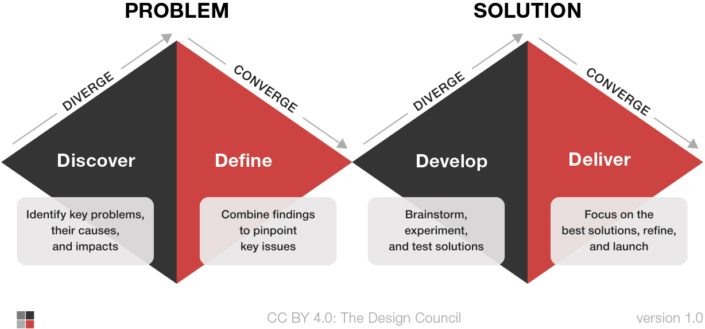

The **Double Diamond design process** is a structured framework developed by the British Design Council, aimed at fostering creativity, collaboration, and clarity in problem-solving. It is divided into two main phases, each consisting of two key stages:

<!--endintro-->

\
**Phase 1: Problem Exploration**

* **Discover:** This stage focuses on understanding the problem by gathering insights from users, stakeholders, and the environment. Methods such as user research, interviews, and observations are essential for uncovering real needs and behaviors.
* **Define:** After collecting data, the next step is to synthesize findings into clear problem statements or design challenges. This helps ensure the right problem is being addressed before moving forward.

**Phase 2: Solution Development**

* **Develop:** In this stage, teams brainstorm, prototype, and explore multiple potential solutions. Rapid iteration, sketching, and usability testing help identify the most viable options.
* **Deliver:** The final step is about refining the chosen solution, conducting user tests, and preparing for launch. Feedback from users ensures the solution is both functional and user-friendly.

**Impact on User Experience Design**

The Double Diamond process has a significant impact on **User Experience (UX) Design** by emphasizing user-centered thinking and iterative improvement. It ensures that design teams:

* **Understand real user needs:** The Discover and Define stages prevent assumptions by grounding the process in user research and data, ensuring the final design is meaningful and relevant.
* **Encourage exploration and creativity:** By diverging to explore a wide range of ideas before converging on the best solutions, designers can innovate while remaining focused on solving the right problem.
* **Deliver usable and delightful solutions:** The iterative nature of the Develop and Deliver phases ensures continuous testing and feedback, leading to products that provide a seamless, intuitive, and enjoyable user experience.

In summary, the Double Diamond process helps UX designers move from ambiguity to clarity, ensuring that the end result not only meets user needs but also enhances satisfaction and engagement.

Add your rule to a category. See [How to Add and Edit Categories and Top Categories](https://github.com/SSWConsulting/SSW.Rules.Content/wiki/How-to-Add-and-Edit-Categories-and-Top-Categories).
